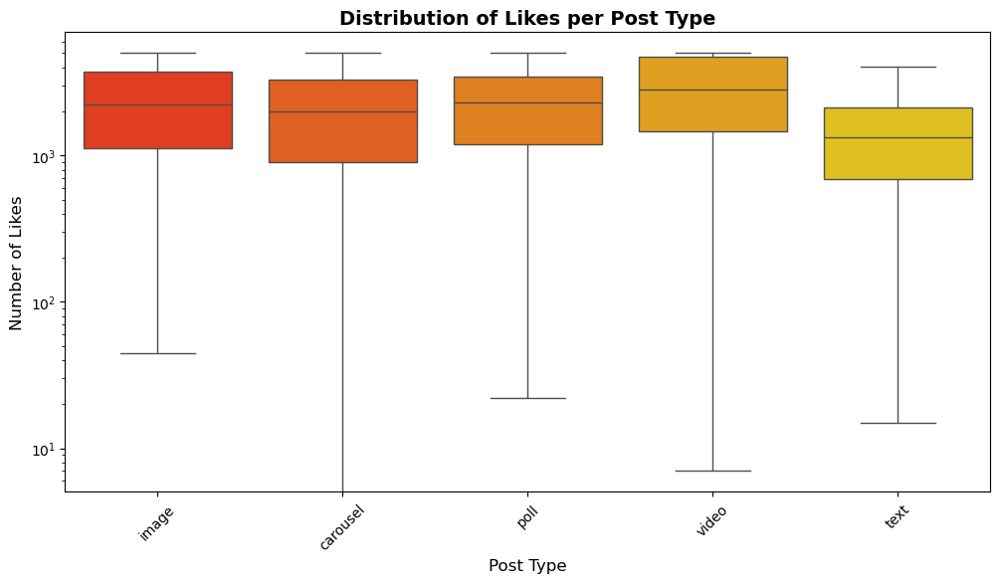
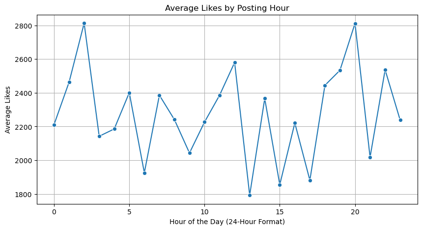

# **Assignment 3 - Ei Kay Khine**

### **Dataset Overview**
This dataset contains information about social media posts across three platforms: **Facebook**, **Instagram**, and **Twitter**. Each row represents a single post, and the columns provide details about the post's engagement, type, timing, and sentiment.


```python
import pandas as pd
import numpy as np
import matplotlib.pyplot as plt
import seaborn as sns

df = pd.read_csv('social_media_engagement.csv')

df.head()
```


<div>
<style scoped>
    .dataframe tbody tr th:only-of-type {
        vertical-align: middle;
    }

    .dataframe tbody tr th {
        vertical-align: top;
    }

    .dataframe thead th {
        text-align: right;
    }
</style>
<table border="1" class="dataframe">
  <thead>
    <tr style="text-align: right;">
      <th></th>
      <th>post_id</th>
      <th>platform</th>
      <th>post_type</th>
      <th>post_time</th>
      <th>caption</th>
      <th>hashtags</th>
      <th>likes</th>
      <th>comments</th>
      <th>shares</th>
      <th>caption_length</th>
      <th>num_hashtags</th>
      <th>post_hour</th>
      <th>post_day</th>
      <th>sentiment_score</th>
    </tr>
  </thead>
  <tbody>
    <tr>
      <th>0</th>
      <td>1</td>
      <td>Facebook</td>
      <td>image</td>
      <td>2023-08-17 14:45</td>
      <td>Best day ever! 🎉</td>
      <td>#Social</td>
      <td>2121</td>
      <td>474</td>
      <td>628</td>
      <td>16</td>
      <td>1</td>
      <td>14</td>
      <td>Thursday</td>
      <td>positive</td>
    </tr>
    <tr>
      <th>1</th>
      <td>2</td>
      <td>Facebook</td>
      <td>carousel</td>
      <td>2023-05-14 00:45</td>
      <td>Here's a quick update.</td>
      <td>#Family, #Community, #Events</td>
      <td>3660</td>
      <td>432</td>
      <td>694</td>
      <td>22</td>
      <td>3</td>
      <td>0</td>
      <td>Sunday</td>
      <td>neutral</td>
    </tr>
    <tr>
      <th>2</th>
      <td>3</td>
      <td>Instagram</td>
      <td>poll</td>
      <td>2023-02-21 16:15</td>
      <td>Not my best day. 😞</td>
      <td>#Beauty, #Fashion, #InstaDaily</td>
      <td>4955</td>
      <td>408</td>
      <td>688</td>
      <td>18</td>
      <td>3</td>
      <td>16</td>
      <td>Tuesday</td>
      <td>negative</td>
    </tr>
    <tr>
      <th>3</th>
      <td>4</td>
      <td>Twitter</td>
      <td>image</td>
      <td>2023-11-16 00:45</td>
      <td>Disappointed but moving on.</td>
      <td>#Trending, #Tech, #Entertainment</td>
      <td>1183</td>
      <td>90</td>
      <td>187</td>
      <td>27</td>
      <td>3</td>
      <td>0</td>
      <td>Thursday</td>
      <td>negative</td>
    </tr>
    <tr>
      <th>4</th>
      <td>5</td>
      <td>Twitter</td>
      <td>video</td>
      <td>2023-05-23 00:30</td>
      <td>Exciting news! 🚀</td>
      <td>#News, #Politics, #Entertainment</td>
      <td>3499</td>
      <td>247</td>
      <td>286</td>
      <td>16</td>
      <td>3</td>
      <td>0</td>
      <td>Tuesday</td>
      <td>positive</td>
    </tr>
  </tbody>
</table>
</div>


# **Summary Statistics**


```python
df.describe(include = "all").round(2)

```


<div>
<style scoped>
    .dataframe tbody tr th:only-of-type {
        vertical-align: middle;
    }

    .dataframe tbody tr th {
        vertical-align: top;
    }

    .dataframe thead th {
        text-align: right;
    }
</style>
<table border="1" class="dataframe">
  <thead>
    <tr style="text-align: right;">
      <th></th>
      <th>post_id</th>
      <th>platform</th>
      <th>post_type</th>
      <th>post_time</th>
      <th>caption</th>
      <th>hashtags</th>
      <th>likes</th>
      <th>comments</th>
      <th>shares</th>
      <th>caption_length</th>
      <th>num_hashtags</th>
      <th>post_hour</th>
      <th>post_day</th>
      <th>sentiment_score</th>
    </tr>
  </thead>
  <tbody>
    <tr>
      <th>count</th>
      <td>1000.00</td>
      <td>1000</td>
      <td>1000</td>
      <td>1000</td>
      <td>1000</td>
      <td>1000</td>
      <td>1000.00</td>
      <td>1000.00</td>
      <td>1000.00</td>
      <td>1000.00</td>
      <td>1000.00</td>
      <td>1000.00</td>
      <td>1000</td>
      <td>1000</td>
    </tr>
    <tr>
      <th>unique</th>
      <td>NaN</td>
      <td>3</td>
      <td>5</td>
      <td>986</td>
      <td>12</td>
      <td>400</td>
      <td>NaN</td>
      <td>NaN</td>
      <td>NaN</td>
      <td>NaN</td>
      <td>NaN</td>
      <td>NaN</td>
      <td>7</td>
      <td>3</td>
    </tr>
    <tr>
      <th>top</th>
      <td>NaN</td>
      <td>Instagram</td>
      <td>poll</td>
      <td>2023-09-20 13:30</td>
      <td>Loving this new vibe! 😍</td>
      <td>#Tech</td>
      <td>NaN</td>
      <td>NaN</td>
      <td>NaN</td>
      <td>NaN</td>
      <td>NaN</td>
      <td>NaN</td>
      <td>Tuesday</td>
      <td>positive</td>
    </tr>
    <tr>
      <th>freq</th>
      <td>NaN</td>
      <td>345</td>
      <td>212</td>
      <td>2</td>
      <td>93</td>
      <td>34</td>
      <td>NaN</td>
      <td>NaN</td>
      <td>NaN</td>
      <td>NaN</td>
      <td>NaN</td>
      <td>NaN</td>
      <td>155</td>
      <td>343</td>
    </tr>
    <tr>
      <th>mean</th>
      <td>500.50</td>
      <td>NaN</td>
      <td>NaN</td>
      <td>NaN</td>
      <td>NaN</td>
      <td>NaN</td>
      <td>2270.05</td>
      <td>218.25</td>
      <td>420.81</td>
      <td>19.70</td>
      <td>1.99</td>
      <td>11.05</td>
      <td>NaN</td>
      <td>NaN</td>
    </tr>
    <tr>
      <th>std</th>
      <td>288.82</td>
      <td>NaN</td>
      <td>NaN</td>
      <td>NaN</td>
      <td>NaN</td>
      <td>NaN</td>
      <td>1500.92</td>
      <td>141.89</td>
      <td>285.58</td>
      <td>3.38</td>
      <td>0.82</td>
      <td>6.85</td>
      <td>NaN</td>
      <td>NaN</td>
    </tr>
    <tr>
      <th>min</th>
      <td>1.00</td>
      <td>NaN</td>
      <td>NaN</td>
      <td>NaN</td>
      <td>NaN</td>
      <td>NaN</td>
      <td>0.00</td>
      <td>10.00</td>
      <td>0.00</td>
      <td>16.00</td>
      <td>1.00</td>
      <td>0.00</td>
      <td>NaN</td>
      <td>NaN</td>
    </tr>
    <tr>
      <th>25%</th>
      <td>250.75</td>
      <td>NaN</td>
      <td>NaN</td>
      <td>NaN</td>
      <td>NaN</td>
      <td>NaN</td>
      <td>1016.75</td>
      <td>97.00</td>
      <td>185.75</td>
      <td>17.00</td>
      <td>1.00</td>
      <td>5.00</td>
      <td>NaN</td>
      <td>NaN</td>
    </tr>
    <tr>
      <th>50%</th>
      <td>500.50</td>
      <td>NaN</td>
      <td>NaN</td>
      <td>NaN</td>
      <td>NaN</td>
      <td>NaN</td>
      <td>2047.00</td>
      <td>186.00</td>
      <td>375.50</td>
      <td>18.00</td>
      <td>2.00</td>
      <td>11.00</td>
      <td>NaN</td>
      <td>NaN</td>
    </tr>
    <tr>
      <th>75%</th>
      <td>750.25</td>
      <td>NaN</td>
      <td>NaN</td>
      <td>NaN</td>
      <td>NaN</td>
      <td>NaN</td>
      <td>3453.25</td>
      <td>327.25</td>
      <td>654.50</td>
      <td>23.00</td>
      <td>3.00</td>
      <td>17.00</td>
      <td>NaN</td>
      <td>NaN</td>
    </tr>
    <tr>
      <th>max</th>
      <td>1000.00</td>
      <td>NaN</td>
      <td>NaN</td>
      <td>NaN</td>
      <td>NaN</td>
      <td>NaN</td>
      <td>5000.00</td>
      <td>500.00</td>
      <td>1000.00</td>
      <td>27.00</td>
      <td>3.00</td>
      <td>23.00</td>
      <td>NaN</td>
      <td>NaN</td>
    </tr>
  </tbody>
</table>
</div>


```python
df.isna().sum()
```


    post_id            0
    platform           0
    post_type          0
    post_time          0
    caption            0
    hashtags           0
    likes              0
    comments           0
    shares             0
    caption_length     0
    num_hashtags       0
    post_hour          0
    post_day           0
    sentiment_score    0
    dtype: int64


```python
df.info()
```

    <class 'pandas.core.frame.DataFrame'>
    RangeIndex: 1000 entries, 0 to 999
    Data columns (total 14 columns):
     #   Column           Non-Null Count  Dtype 
    ---  ------           --------------  ----- 
     0   post_id          1000 non-null   int64 
     1   platform         1000 non-null   object
     2   post_type        1000 non-null   object
     3   post_time        1000 non-null   object
     4   caption          1000 non-null   object
     5   hashtags         1000 non-null   object
     6   likes            1000 non-null   int64 
     7   comments         1000 non-null   int64 
     8   shares           1000 non-null   int64 
     9   caption_length   1000 non-null   int64 
     10  num_hashtags     1000 non-null   int64 
     11  post_hour        1000 non-null   int64 
     12  post_day         1000 non-null   object
     13  sentiment_score  1000 non-null   object
    dtypes: int64(7), object(7)
    memory usage: 109.5+ KB
    

### **Dataset Summaries**
- **Platform Distribution**: The dataset contains posts from three platforms. Instagram has the most posts, followed by Facebook and Twitter.
- **Post Types**: The most common post types are images and videos, while polls and carousels are less frequent.
- **Missing Values**: The dataset has no missing values in any of the columns.
- **Data Types**: The dataset contains a mix of numerical and categorical data.

# **Data Analysis**

### 1. Counts of Posts per Platform


```python
plt.figure(figsize=(12, 6))
sns.countplot(data=df, x="platform", hue="platform", order=df["platform"].value_counts().index, palette="autumn", legend=False)

plt.title("Number of Posts per Platform", fontsize=14, fontweight="bold")
plt.xlabel("Platform", fontsize=12)
plt.ylabel("Count of Posts", fontsize=12)
plt.xticks(rotation=45)

plt.show()
```


    

    


**Engagement Varies by Platform**
- Instagram posts get the most likes on average.
- Facebook and Twitter tend to have fewer likes but may generate engagement through comments and shares instead.
- Possible reasons:
    - Instagram is highly visual, leading to more likes.
    - Twitter relies on text-heavy posts, which may encourage discussions rather than likes.

### 2. Post Type Analaysis 


```python
post_type_engagement = df.groupby("post_type")[["likes", "comments", "shares"]].mean().reset_index()
post_type_engagement_melted = post_type_engagement.melt(id_vars="post_type", var_name="Engagement Type", value_name="Average Engagement")

plt.figure(figsize=(12, 6))
sns.barplot(data=post_type_engagement_melted, x="post_type", y="Average Engagement", hue="Engagement Type", palette="autumn")

plt.title("Average Engagement by Post Type", fontsize=14, fontweight="bold")
plt.xlabel("Post Type", fontsize=12)
plt.ylabel("Average Engagement", fontsize=12)
plt.xticks(rotation=45)

plt.show()
```


    

    


**Engagement by Post Type**

Based on the graph, engagement depends most on likes. 
- Videos consistently outperform images and text posts in all engagement metrics (likes, comments, and shares).
- Text-based posts receive the least engagement across all categories.

- Possible reason:
    - Social media algorithms tend to boost video content, increasing visibility and engagement.
    - Users may scroll past text posts quickly without engaging. Video content holds attention longer, leading to more interactions.

### 3. Distribution of Likes per Post Type


```python
plt.figure(figsize=(12, 6))
sns.boxplot(data=df, x="post_type", y="likes", hue="post_type", palette="autumn")

plt.title("Distribution of Likes per Post Type", fontsize=14, fontweight="bold")
plt.xlabel("Post Type", fontsize=12)
plt.ylabel("Number of Likes", fontsize=12)
plt.xticks(rotation=45)
plt.yscale("log") 

plt.show()
```


    

    


**Post Type Impacts Likes**
- Images and videos attract the highest number of likes.
- Text and polls receive fewer likes but may drive engagement through comments instead.
- Carousels (multi-image posts) also perform well, suggesting users engage more with visually appealing content.


### 4. Distrubution of Likes by Posting Hour


```python
df['post_hour'] = df['post_hour'].astype(int)

likes_by_hour = df.groupby('post_hour')['likes'].mean().reset_index()

plt.figure(figsize=(10, 5))
sns.lineplot(data=likes_by_hour, x='post_hour', y='likes', marker='o')
plt.title('Average Likes by Posting Hour')
plt.xlabel('Hour of the Day (24-Hour Format)')
plt.ylabel('Average Likes')
plt.grid(True)
plt.savefig("likes_by_post_hour.png")  # Save the plot
plt.show()
```


    

    


**Posting Hour Matters**
- There are clear peaks around late night 2am, midday 12pm, and evening 8pm. This may be due to people having free time after work and before sleep. 
- Engagement seems to drop significantly during certain hours, between 1-5pm. This may be due to people being at work or school. 

# **Conclusion**

- Instagram dominates in terms of post volume, which means engagement trends might be skewed towards this platform.
- Videos and images are the best-performing content types across likes, comments, and shares, but they also exhibit variability.
- Polls and carousels tend to have lower engagement across all metrics, making them less effective for driving interactions.
- Posting at the right times can increase visibility and engagement.

**Key Takeaway:** If you're managing social media for engagement, focus on videos and images, especially on Instagram, while being mindful of posting hours and content quality to ensure higher interaction rates.
